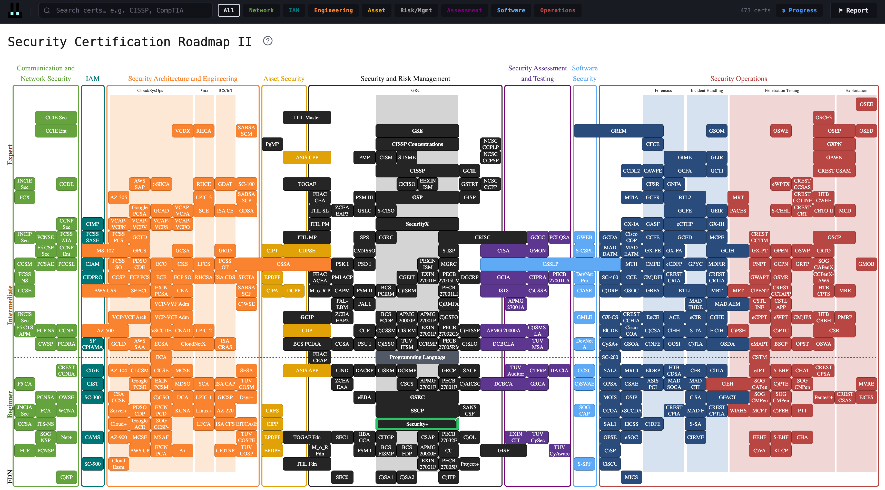
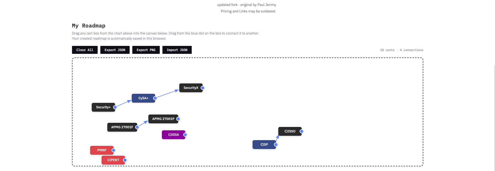

# Security Certification Roadmap II

#### A modernized fork of Paul Jerimy's Security Certification Roadmap. This version updates it for 2026, adds interactivity, and lets you build your own roadmap from it.

View at https://datahackshaw.com/cybersec-roadmap/

## Screenshots

## What's different

1. Certs updated, added, and removed (a lot changes in two years) - *SEE [CHANGELOG](/CHANGELOG.md)*
2. Search and domain filter controls
3. Certification progress tracking and visibility
4. Hover tooltips with pricing and brief cert descriptions
5. "My Roadmap" canvas — drag certs from the chart to build and save your own path, draw connections between them, and export as PNG or JSON

## Credits
#### Original chart by Paul Jerimy — [pauljerimy.com](https://pauljerimy.com) · [GitHub](https://github.com/PaulJerimy/SecCertRoadmap)